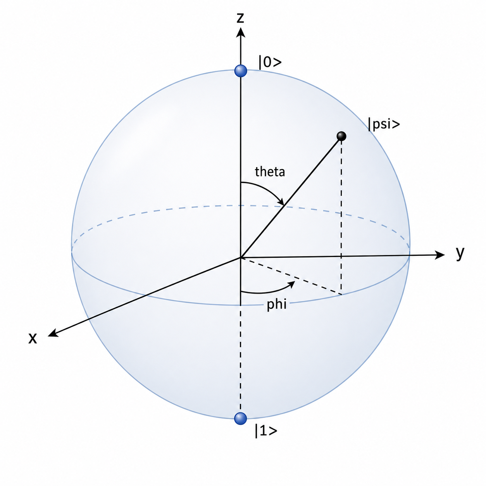

# Bloch Sphere

## Overview

The **Bloch sphere** is a geometric picture of a single qubit state.

A general normalized qubit state can be written as:

$$
|\psi\rangle = \alpha|0\rangle + \beta|1\rangle
$$

where $\alpha$ and $\beta$ are complex numbers satisfying:

$$
|\alpha|^2 + |\beta|^2 = 1
$$

Because two states that differ only by a global phase represent the same physical state, every pure single-qubit state can also be written as:

$$
|\psi\rangle = \cos\left(\frac{\theta}{2}\right)|0\rangle + e^{i\phi}\sin\left(\frac{\theta}{2}\right)|1\rangle
$$

The angles $\theta$ and $\phi$ locate a point on the unit sphere:

$$
\begin{aligned}
x &= \sin\theta\cos\phi \\
y &= \sin\theta\sin\phi \\
z &= \cos\theta
\end{aligned}
$$

## Intuition

The north pole represents $|0\rangle$, and the south pole represents $|1\rangle$. Points on the equator represent equal-probability superpositions, such as:

$$
\frac{|0\rangle + |1\rangle}{\sqrt{2}}
$$

The Bloch sphere turns an abstract two-dimensional complex vector into a three-dimensional geometric picture. Single-qubit unitary operations can be viewed as rotations of the sphere, while measurements along different axes are connected to the eigenvectors of the Pauli matrices.

## Book Note Context

[Nielsen and Chuang's postulates section](../Book%20Notes/Nielsen%20Chuang/Chapter%202/Postulates%20of%20Quantum%20Mechanics.md) gives the direct qubit starting point: a state is a unit vector $|\psi\rangle=\alpha|0\rangle+\beta|1\rangle$, normalization requires $|\alpha|^2+|\beta|^2=1$, global phase does not change the physical state, and relative phase can matter. Those facts are exactly what make the two-angle Bloch-sphere parametrization possible.

[Townsend's Stern-Gerlach chapter](../Book%20Notes/Townsend/Chapter%201/Stern-Gerlach%20Experiments.md) gives the spin-$1/2$ physical model behind the same geometry. A state can be expanded as $|\psi\rangle=c_+|+z\rangle+c_-|-z\rangle$, and changing from $z$-basis to $x$-basis shows why different measurement axes correspond to different directions on the sphere.

[Shankar's postulates](../Book%20Notes/Shankar/Chapter%204/The%20Postulates.md) supply the broader Hilbert-space viewpoint: a quantum state is a vector, observables are Hermitian operators, measurement outcomes are eigenvalues, and probabilities come from projections onto eigenvectors. For a two-dimensional system, the Bloch sphere is a compact visualization of that general postulate structure.

## Related Concepts

- [Quantum Computing](Quantum%20Computing.md)
- [Quantum Mechanics](../Quantum%20Mechanics/Quantum%20Mechanics.md)
- [Vectors](../Linear%20Algebra/Vectors.md)
- [Bra-Ket Notation](../Linear%20Algebra/Bra-Ket%20Notation.md)
- [Eigenvalues](../Linear%20Algebra/Eigenvalues%20and%20Eigenvectors.md)
- [Unitary Matrices](../Linear%20Algebra/Unitary%20Matrices.md)

<!-- semantic-edges
{"source":"Bloch Sphere","relation":"VISUALIZES","target":"Pure Single-Qubit States","evidence_heading":"Overview","evidence_summary":"The note writes a normalized qubit state and then removes global phase to represent every pure single-qubit state by two angles on the unit sphere.","confidence":0.95}
{"source":"Global Phase Equivalence","relation":"ENABLES","target":"Bloch Sphere Parametrization","evidence_heading":"Overview","evidence_summary":"Because states differing only by global phase are physically equivalent, the qubit state can be parametrized by theta and phi instead of two arbitrary complex amplitudes.","confidence":0.95}
{"source":"Relative Phase","relation":"DETERMINES","target":"Bloch Sphere Azimuth","evidence_heading":"Overview","evidence_summary":"The phase factor e^{i phi} in the qubit state determines the azimuthal angle phi on the Bloch sphere.","confidence":0.9}
{"source":"Bloch Sphere","relation":"REPRESENTS","target":"Computational Basis States","evidence_heading":"Intuition","evidence_summary":"The note says the north pole represents |0> and the south pole represents |1>.","confidence":0.9}
{"source":"Bloch Sphere","relation":"VISUALIZES","target":"Equal-Probability Superpositions","evidence_heading":"Intuition","evidence_summary":"The note says equator points represent equal-probability superpositions such as (|0> + |1>)/sqrt(2).","confidence":0.9}
{"source":"Single-Qubit Unitary Operations","relation":"REPRESENTS","target":"Bloch Sphere Rotations","evidence_heading":"Intuition","evidence_summary":"The note says single-qubit unitary operations can be viewed as rotations of the Bloch sphere.","confidence":0.9}
{"source":"Pauli Matrices","relation":"DETERMINES","target":"Bloch Sphere Measurement Axes","evidence_heading":"Intuition","evidence_summary":"The note connects measurements along different axes to eigenvectors of the Pauli matrices.","confidence":0.85}
-->
